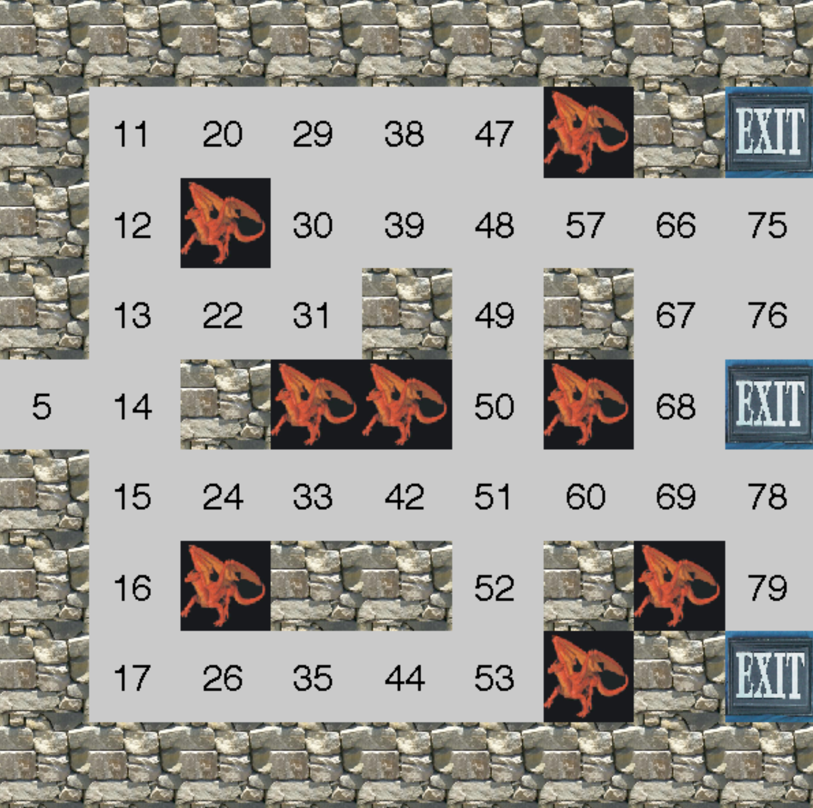
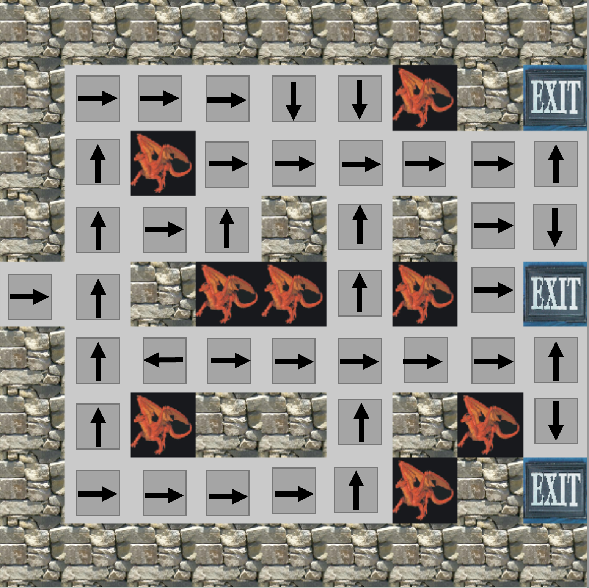

# RL-Agent-SolveMaze
solving a maze by using policy and value iteration methods to find the optimal policy for an agent.
The goal is to find a quickest route to Exit without get eaten by dragons. there are four actions 
available for agent at each state. 
Actions are: $a_{1}$ = go West, $a_{2}$ = go North, $a_{3}$ = go East, $a_{4}$ = go South.
Discount factor $\gamma = 0.99$ 

The maze has 81 squares (states) as shown below. The states that are available for agent walk through are numbered on the image 

   

This repo include two appraoches to solve the maze, policy iteration and value iteration

### Policy Iteration:

initial policy $\pi_{0}$ ----> evaluate: $V^{\pi_{0}}$ and $Q^{\pi_{0}}$ for all states ----> improve: $\pi_{1}$ by taking action s.t. $argmax_{a} Q^{a}$ for each state ----> repeat
- Note that each iteration include matrix inversion $O(n^{3})$
- It converges to optimal policy $\pi^{*}$ 

### Value Iteration:

initialize $V_{0} = 0$ for all states ----> iterate, at K+1 iteration: $V_{K+1}(s) = R(s) + \gamma max_{a} \sum_{s'} P(s' | s,a) V_{K}(s')$
- This approach only update Value functions directly. 
- It converges to optimal value function $V^{*}(s)$

### Optimal Policy:
Below is the image of optimal policy by showing best action at each state.

  

